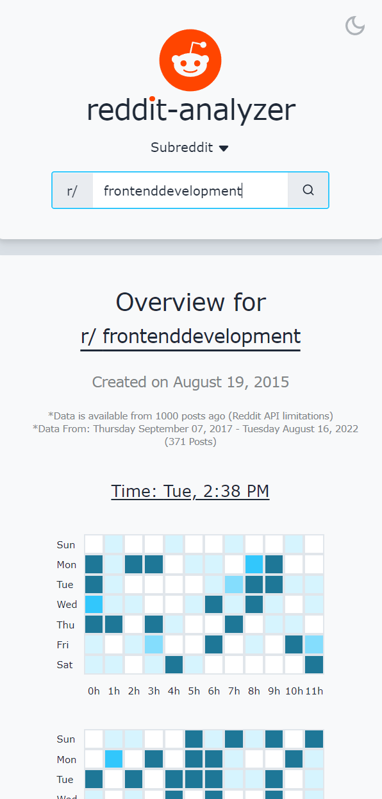

# Reddit Analyzer

> A web app data visualizing tool used to view Reddit User's data and Subreddit
> traffic activity.

## 🚀 Objective

> To create an aesthetic and visual tool that helps Reddit users visualize their
> past activity on the platform. Also to identify the best optimal time of the
> week to post on a Subreddit based on it's past activity.

## 📸 Screenshots

<ul style="display:flex flex-direction:column">
 

    
</ul>

### Dark Mode

<ul style="display:flex flex-direction:column">
  


</ul>

### Mobile Design

<ul style="display:flex">
  
  
  
  
</ul>

## 🎥 Live Demo

<a href="https://jonathancarpena.me/work/demo/Reddit%20Analyzer" target="_blank" rel="noopener noreferrer">Click
Here 🔗</a>

## 📋 Features

-  Reddit user data visualization
-  Subreddit activity over time
-  Optimal subreddit posting time
-  Responsive Web Design
-  Dark Mode Theme

## ⚙ Technologies

-  Next.js
-  Reddit API
-  Axios
-  Tailwind CSS
-  Recharts

## 🛠 Installation and Setup

### Install

Clone down this repository. You will need node and npm installed globally on
your machine.

```
$ git clone https://github.com/jonathancarpena/reddit-analyzer.git
```

Install project folder with `npm install`

### Scripts

Development mode. Open http://localhost:3000 to view it in the browser.

```
npm run start
```

